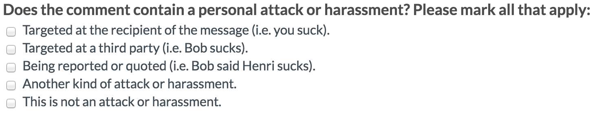

**Brief about the dataset:**

Each comment was labeled by multiple annotators via Crowdflower on whether it contains a personal attack. We also include some demographic data for each crowd-worker. 

The questionare used by the annotators:

**Overview and schema of the dataset:**

Three files we're dealing with:

- **attack_annotated_comments.tsv** - the raw revisions and derived comments that were labelled by crowdworkers.
- **attack_annotations.tsv** - the annotations labeled by several crowdworkers for each comment in *attack_annotated_comments.tsv*.
- **attack_worker_demographics.tsv** - To help understand the generality of the crowd-worker labels, this contains the result of a survey to get some basic anonymized demographic information about on the crowdworkers who provided the labels.

To join these files:

- *attack_annotations.tsv* and *attack_annotated_comments.tsv* can be joined by **rev_id**.
- *attack_annotations.tsv* and *attack_worker_demographics.tsv* can be joined by **worker_id**.

**1. attack_annotated_comments.tsv**

- The comment text and metadata for comments with attack labels generated by crowd-workers. The actual labels are in the corresponding *attack_annotations.tsv* since each comment was labeled multiple times.
  - **rev_id:** MediaWiki revision id of the edit that added the comment to a talk page (i.e. discussion).
  - **comment:** Comment text. Consists of the concatenation of content added during a revision/edit of a talk page. MediaWiki markup and HTML have been stripped out. To simplify tsv parsing, \n has been mapped to NEWLINE_TOKEN, \t has been mapped to TAB_TOKEN and " has been mapped to `.
  - **year:** The year the comment was posted in.
  - **logged_in:** Indicator for whether the user who made the comment was logged in. Takes on values in {0, 1}.
  - **ns:** Namespace of the discussion page the comment was made in. Takes on values in {user, article}.
  - **sample:** Indicates whether the comment came via random sampling of all comments, or whether it came from random sampling of the 5 comments around a block event for violating [WP:npa](https://en.wikipedia.org/wiki/Wikipedia:No_personal_attacks) or [WP:HA](https://en.wikipedia.org/wiki/Wikipedia:Harassment). Takes on values in {random, blocked}.
  - **split:** For model building in the original [paper](https://arxiv.org/abs/1610.08914), the authors had split comments into train, dev and test sets. Takes on values in {train, dev, test}.

**Example:**

**rev_id comment year logged_in  ns sample split**

421948	`NEWLINE_TOKENNEWLINE_TOKEN::: Pointing out which word is used less than others seems unnecessary. It's not a competition. Each should be a stand alone article, each should be linked to and from the ``discrediting tactic`` article, and each should have basically the exact same wording (if they exist at all). NEWLINE_TOKENNEWLINE_TOKEN:::Besides, it would be hard to prove which one is used less. People that hate Bush will hear ``Bushism`` more, people that hate Gore will hear ``goreism`` more. If we surveyed the Wikipedia family, I think we'd hear from our fair share of both groups. -jazz77`	2002	False	article	random	test

1240138	AnonNEWLINE_TOKENNEWLINE_TOKEN:What the heck are you talking about? This is an encyclopedia, not a book store. 	2003	True	article	random	dev

**2. attack_annotations.tsv**

Personal attack labels from crowd-workers for each comment in *attack_annotated_comments.tsv*. It can be joined with *attack_annotated_comments.tsv* on **rev_id**.

- **rev_id:** MediaWiki revision id of the edit that added the comment to a talk page (i.e. discussion).
- **worker_id:** Anonymized crowd-worker id.
- **quoting_attack:** Indicator for whether the worker thought the comment is quoting or reporting a personal attack that originated in a different comment..
- **recipient_attack:** Indicator for whether the worker thought the comment contains a personal attack directed at the recipient of the comment.
- **third_party_attack:** Indicator for whether the worker thought the comment contains a personal attack directed at a third party.
- **other_attack:** Indicator for whether the worker thought the comment contains a personal attack but is not quoting attack, a recipient attack or third party attack.
- **attack:** Indicator for whether the worker thought the comment contains any form of personal attack. The annotation takes on value 0 if the worker selected the option "This is not an attack or harassment" and value 1 otherwise.

**Example:**

**rev_id	worker_id	quoting_attack	recipient_attack	third_party_attack	other_attack	attack**

1240138	  748	0.0	0.0    0.0    0.0    0.0

1240138	1532	0.0	1.0	0.0	0.0	1.0

1240138	1409	0.0	1.0	0.0	0.0	1.0

**3. attack_worker_demographics.tsv**

Demographic information about the crowdworkers. This information was obtained by an optional demographic survey administered after the labelling task. It is meant to be joined with *attack_annotations.tsv* on **worker_id**. Some fields may be blank if left unanswered.

- **worker_id:** Anonymized crowd-worker id.
- **gender:** The gender of the crowd-worker. Takes a value in {'male', 'female', and 'other'}.
- **english_first_language:** Does the crowd-worker describe English as their first language. Takes a value in {0, 1}.
- **age_group:** The age group of the crowd-worker. Takes on values in {'Under 18', '18-30', '30-45', '45-60', 'Over 60'}.
- **education:** The highest education level obtained by the crowd-worker. Takes on values in {'none', 'some', 'hs', 'bachelors', 'masters', 'doctorate', 'professional'}. Here 'none' means no schooling, some means 'some schooling', 'hs' means high school completion, and the remaining terms indicate completion of the corresponding degree type.

**Example:**

**worker_id	gender	english_first_language	age_group	education**

1532	male	0	30-45	bachelors

  529	female	0	30-45	hs

